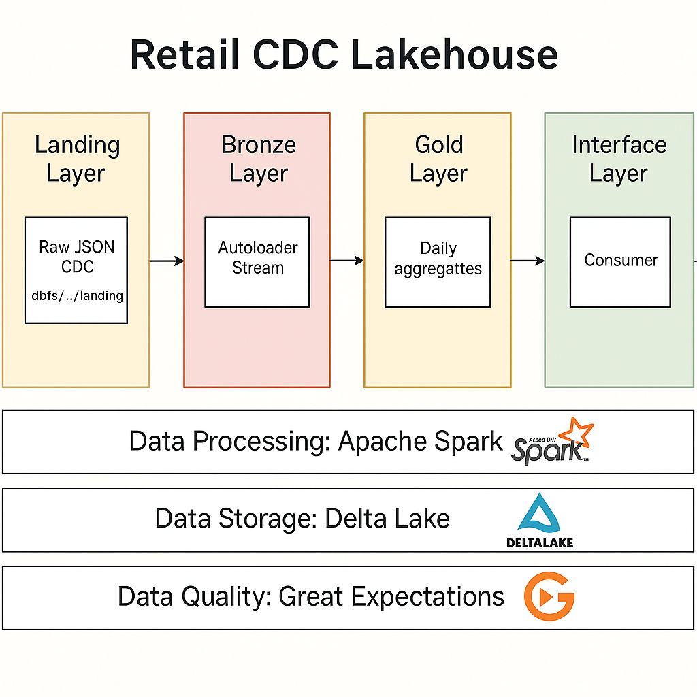

# Real-Time CDC Data Pipeline using Databricks, Spark Streaming, Auto Loader, and Delta Lake

## Project Objective

This project demonstrates how a real-time data pipeline can be built end-to-end using Databricks, Spark Structured Streaming, and Delta Lake.  
The goal is to show how **Change Data Capture (CDC)** data flows through a modern Lakehouse from raw change events all the way to clean, analytics-ready tables.

To keep the setup lightweight and easy to recreate, the pipeline simulates CDC events (similar to Debezium or Kafka) using Python, then processes them with PySpark. This makes it possible to focus on the core engineering concepts including streaming ingestion, CDC upserts, deletions, and data quality checks without relying on heavy external systems.

The result is a simple, fully runnable example of a retail-style CDC pipeline that highlights how Bronze, Silver, and Gold layers work together in a Lakehouse architecture.

---

## Architecture Diagram

Below is the high-level diagram of the pipeline.  
This shows how CDC JSON events move through Landing → Bronze → Silver → Gold layers.



---

## What This Project Does

- Generates fake **CDC JSON events** (`create`, `update`, `delete`)
- Ingests those events using **Auto Loader** into a Bronze Delta table
- Applies CDC logic using **Delta MERGE** into Silver
- Builds a simple Gold table with daily sales metrics
- Runs a few small SQL queries to explore the data

---

## Tech Used

- **Databricks**
- **Apache Spark**
- **Spark Structured Streaming**
- **Auto Loader (cloudFiles)**
- **Delta Lake**
- **Python**
- **Great Expectations (inline checks only)**

---

## Project Structure

```
retail_databricks_notebooks/
│
├── notebooks/
│   ├── setup_install.py
│   ├── config.py
│   ├── generate_cdc.py
│   ├── bronze_stream.py
│   ├── silver_etl.py
│   ├── gold_etl.py
│   ├── data_quality.py
│   ├── sql_queries.py
│   └── stop_streams.py
│
└── images/
    └── architecture.png
```

---

## Bronze → Silver → Gold Flow

1. **Landing** – Raw CDC JSON files land here.  
2. **Bronze** – Auto Loader streams in raw events and normalizes them.  
3. **Silver** – Applies CDC logic (insert/update/delete) using Delta MERGE.  
4. **Gold** – Daily aggregated metrics.

---

## ▶️ Running the Project

1. Run `notebooks/setup_install.py`  
2. Configure paths in `notebooks/config.py`  
3. Generate CDC events using `notebooks/generate_cdc.py`  
4. Start streaming ingestion using `notebooks/bronze_stream.py`  
5. Apply MERGE logic using `notebooks/silver_etl.py`  
6. Build aggregates using `notebooks/gold_etl.py`    
7. Stop streams with `notebooks/stop_streams.py`

---

## 🧪 Sample CDC Event

```
{
  "op": "u",
  "before": {...},
  "after": {...}
}
```

---

## What to Learn

- Auto Loader fundamentals  
- Bronze/Silver/Gold layering  
- Delta MERGE with CDC  
- Structuring PySpark ETL code  
- Running streaming jobs on Databricks  

